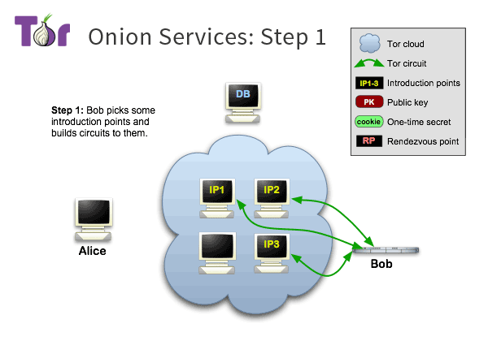
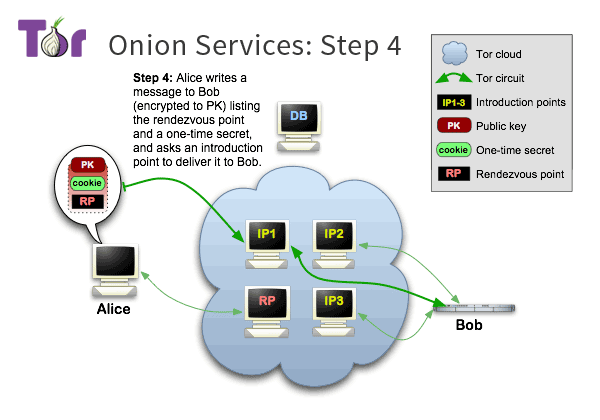
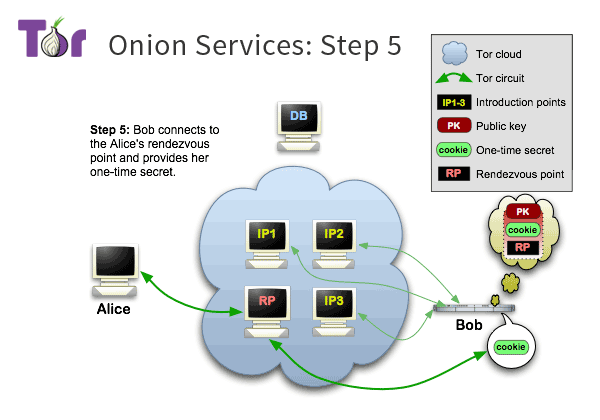

<!-- $size: 16:9 -->
<!-- page_number: false -->
 

#
#
#
#
# Online Privacy: 
## The  Network

#
#
#
#
#

<!-- Creative Commons Attribution-ShareAlike -->

---
#
#
#
#
#

# 
Sharing is Caring 

*
Please copy, share, and remix!
*
#
#

 grab a copy of the presentation: 
  
[github.com/francisco-core/tecnical-intro-to-tor/](https://github.com/seandiggity/citizen-foss)

#
#
#
#

<!-- Creative Commons Attribution-ShareAlike -->&nbsp;  This presentation is under the Creative Commons Attribution-ShareAlike License

---
<!-- page_number: true -->
<!-- Motivation -->

## 
 On the Internet, nobody knows you're a dog.

----

 

---

# *Why is there a need for privacy?*
<!-- $theme: default -->

---

# Privacy 
## gives people a safe place

---

 

# If everything is recorded, you never know what is going to be used against you

&nbsp;<!-- whitespace -->

# You self-censor

> Observation changes behavior

---

#
#
#
#
#

# Privacy is essential 
# for a ==Free Society==

---

# But...
# The Internet is NOT a private place

---

# With no additional protection
## we are exposed
--- 

# IP addresses are geolocated
## and sent allong with each message 
 
 

---

# ISPs know every website you visit / services you use

<!-- source: https://manurevah.com/blah/en/blog/ISP-vs-VPN-vs-Tor -->

---

# HTTPS wide deployment is very recent

<!-- source https://www.youtube.com/watch?v=py2qmGbyhlw -->

---

# Cookies

#
**Cookies** have been preverted from their original function
and abused to **track people** online for marketing purposes.

---

# Browser Fingerprinting

from a [*"How Unique Is Your Web Browser?"* by Peter Eckersley](https://panopticlick.eff.org/static/browser-uniqueness.pdf)

---

# Passive Analysis of the Internet Backbone

----

# Surveillance Capitalism

> The business model where **data is money**

<!-- more info on surveillance capitalism can be found here: https://www.youtube.com/watch?v=Ya1eTbTUUvc (Facebook & Google: The Age of Surveillance Capitalism by Forever Computing) -->

&nbsp;<!-- whitespace -->

&nbsp;<!-- whitespace -->
&nbsp;<!-- whitespace -->

> #  &nbsp;&nbsp; ==driving force==
> #  &nbsp;&nbsp;&nbsp;&nbsp;&nbsp;&nbsp;&nbsp;&nbsp;of surveillance 

---

# 
 So, what do we do about it? 

#

> ## 
 We create an anonymity network on top 

>
> ## 
 of a non-anonymous one 

#
#
#

 yeah, Computer Science has wonders like these

  
---

# Approaches to Privacy and Anonymity

###### There are various approaches to anonymity online, with different trade-offs. 

---

# Single Proxy / VPN

---

# Single Proxy / VPN

---

# 
 Major Flaws 

&nbsp;<!-- whitespace -->

## 
  1. **Trust**  

## 
  2. **Liability for the Provider**  

## 
  3. **Traffic Correlation**  

---

# 1. We have to Trust

&nbsp;<!-- whitespace -->

privacy **by Policy** 
privacy **by Design**

<!-- privacy by design logo is from the Privacy by Design Foundation (https://privacybydesign.foundation/) -->

---

# 2. Liability for the Provider

---

# 3. Traffic Correlation

---

# Our activities are linkable
> A lead can lead to everything else

---

# VPNs are Pseudonymous

Through fingerprinting it is possible to indentify users

---

# Anonymity is Hard

---

# Onion Routing

* ## use a chain of relays
* ## public key encryption for each of them

---

# Onion Routing

<!-- Well, there must be a think with food metaphors on computer networks, because we have *Hot Potato Routing* and now *Onion Routing* -->

---

<!-- The onion part comes from the fact that the packets look like an onion and after each step, one layer is peeled way -->
# I don't see any onions there...

&nbsp;<!-- whitespace -->

 The *onion pattern* also comes up when we think of internet packets and their layers

---

## Tor implements Onion Routing as an ==overlay network==

> Designed to anonymize **any TCP-based applications**
>
> through transparent proxy settings

<!-- Note: Show proxy settings to send any application through the tor proxy -->

 

&nbsp;<!-- whitespace -->

  

<!--So, the tor network is actually a collection of nodes/relays which forward your traffic to the next node. In total, it typically forwards it through 3 -->

---

# Onion Circuit

## A circuit is a sequence of 3 nodes: *==Guard==, ==Middle==* and *==Exit==*

---

# Nodes are ran by ==Volunteers== all around the World

---

# Not all Volunteers have good intentions

Tor is resistant to ==**bad relays**== to a certain extent 
But if they are too many it harms the nework and some uses might get de-anonymised

---

# How to decide which nodes are part of the network?

---

# Consensus Mechanism 

<!-- taken from this article detailing the consensus mechanism: https://jordan-wright.com/blog/2015/05/14/how-tor-works-part-three-the-consensus/ -->
#
Anyone can see the votes of each relay by downloading `http://[directory_authority]/tor/status-vote/current/consensus/` 

#

Typically this is fetched trough http but now it can be fetched through tor, leaving less traces that the user is using tor.

The ==**consensus status**== can be found [here](https://consensus-health.torproject.org/consensus-health.html)

---

# Your computer chooses the circuit

<!-- explain to people that it's their computer that chooses the circuit and no-one else -->
<!-- 1. Retrieve the list of available nodes
2. Choose three nodes (Guard, Middle, Exit)
3. Establish Circuit -->

---

# Anonymity is Fragile

Everything we do is identifying:
* the pattern of our browsing habits
* the way we write text
* the way we code
* our typing speed, etc

#
#
###### This means that
## Tor alone is ==not enough==

<!-- Anonymity is the lack of identity, as opposed to simply pseudonymity where one keeps the identity hidden under an alias. The problem with the later is that there is a data trail of the stuff done under that alias and it is only needed one identifying detail or some association, to connect that identity with the irl person behind it. With perfect anonymity, you cannot be distinguished from any other anonymous person. Think of various people with the exact same closes, height, face, etc. While an alias is wearing a different mask, but always the same one.-->

<!-- # Anonymity is identifiability only in one's actions 
<!-- image and quote from here https://concurringopinions.com/archives/2011/01/privacy-vs-security-vs-anonymity.html-->

<!----->

<!-- The Tor does allow you to be anonymous, but with no additional measures, it would be trivial to see you're the same person who visited this or that website last time, given enough resources.-->

--- 

# Tor Browser

A browser developed by the Tor Project that:
* sends traffic through the Tor network
* Implements additional measures to prevent the user to unwittingly giving away her/his identity
#

---

  

# Stream Isolation

**Identity Correlation**: If the user is reading emails
at the same time of browsing the web the activities can be correlated and the user identified

To fight this Tor implements **Stream Isolation**
Creates a different circuit for each website / applic.

<!-- Since Anonymity requires unlink-ability we must separate as much as possible different sources of information. This is why we do **Stream Isolation** -->

  

---

# Onion Services

> "End-to-End" Anonymity
>
> Aka. "" The Dark Web ""
#
The traffic never leaves the Tor network

Privacy for the user and the website operator.

<!-- Both parties benefit from the anonymity provided by the tor network. The messages never leave the TOR network. And there is no need for DNS of any sort. The addresses are something like http://sik5nlgfc5qylnnsr57qrbm64zbdx6t4lreyhpon3ychmxmiem7tioad.onion/ The address is in fact the public key of the onion, meaning that if you have the address right, then you are talking exactly to the right person. No domain hijacking can happen because the only person able to prove that that address is theirs is the person with the cryptographic private key, meaning the one who runs the server and no one else. Being that DNS is currently the weakest link in the whole Internet infrastructure, this is quite an improvement, given  that we don't mind the small delay introduced.-->

<!-- What if you want to run a website without having to reveal private information? You can do that with onion services. -->
#
#
#
example of **misinformation** 
about onion services
#
###### (they only account for 3% of all tor traffic)

---

# How does it look like?
Version 2: http://qubesos4rrrrz6n4.onion/
Version 3: http://sik5nlgfc5qylnnsr57qrbm64zbdx6t4lreyhpon3ychmxmiem7tioad.onion/

---

# Self Authentication

**No need** for Certificate Authorites

#
#
## The URL is the publick key
correct URL = correct website 

[http://sik5nlgfc5qylnnsr57qrbm64zbdx6t4lreyhpon3ychmxmiem7tioad.onion/](http://sik5nlgfc5qylnnsr57qrbm64zbdx6t4lreyhpon3ychmxmiem7tioad.onion/) 

---

<!-- more info on onion services can be found here: https://www.torproject.org/docs/onion-services -->

---

---

---

---

---

# Censorship Resistance

A direct consequence of anonymity
#
> If I don't know who you are or where you go, 
> I cannot block you access based on that information

<!--If they don't know where you are, they cannot deny you access base on you're location. If they do, you just change it in a second. This works unless they block Tor specifically -->

---

# Resources

Where you can find more information about how Tor works:

* [A soft introduction to the Tor network written in Spanish](https://tor.derechosdigitales.org/torificate/)
* [Read the Orignal paper of tor](https://svn.torproject.org/svn/projects/design-paper/tor-design.pdf)
* Thirteen key design changes since the original 2004 paper: [part one](https://blog.torproject.org/blog/top-changes-tor-2004-design-paper-part-1), [part two](https://blog.torproject.org/blog/top-changes-tor-2004-design-paper-part-2), [part three](https://blog.torproject.org/blog/top-changes-tor-2004-design-paper-part-3). 
* [Tor Documentation](https://www.torproject.org/docs/documentation.html.en)

---

# Image credits
*Copyright of the images to their respective owner. Used for the purpose of illustration*
| image | credit |
|-------|--------|
|| Hard to credit but it seems to come from an article from [wired](https://www.wired.com/2016/12/botnet-broke-internet-isnt-going-away/). The image was based on that one, but modified to add all of tor and nsa's logos.|
|  | "On the Internet, nobody knows you're a dog"  The [famous cartoon](https://en.wikipedia.org/wiki/On_the_Internet%2C_nobody_knows_you're_a_dog) by Peter Steiner.

---

| image | credit |
|:-----:|--------|
|  | The 2015 upgrade to the decades-old cartoon made by  Kaamran Hafeez and published in The New Yorker on February 23, 2015  |
| | A very nice illustration of the Panopticon prision concept. Taken from an [NYtimes article](https://www.nytimes.com/2013/07/21/books/review/the-panopticon-by-jenni-fagan.html) |

----
| image | credit |
|:-----:|-------|
|       |   made by [Privacy International](https://privacyinternational.org/feature/2300/what-european-court-ruling-means-mass-spying-around-world)     |
|     |  Taken from [this blog](https://manurevah.com/blah/en/blog/ISP-vs-VPN-vs-Tor)      |
| | privacy by design logo is from the [Privacy by Design Foundation](https://privacybydesign.foundation/)|
|  | From Brian Ford's article ["Seeking Anonymity in an Internet Panopticon"](https://arxiv.org/abs/1312.5307) 

---

| image | credit |
|:-----:|--------|
|| [Tor's logo](https://torproject.org)|
| | [Wikimedia Commons](https://commons.wikimedia.org/wiki/File:Onion_diagram.svg)|
|  | You can find more fancy graphics of on [tor metrics](https://metrics.torproject.org/) |
||Taken from [this article](https://jordan-wright.com/blog/2015/05/14/how-tor-works-part-three-the-consensus/) detailing the consensus mechanism

----

| image | credit |
|:-----:|--------|
|  | more similar diagrams [here](https://www.torproject.org/about/overview)|
|  | [Onion Circuits](https://tails.boum.org/doc/anonymous_internet/tor_status/index.en.html) is an application for viewing the current open and build tor circuits. It's quite good for new people using tor as they can see all that is going on in the background without it being too technical.|
|  | Image of stream isolation of [whonix](https://www.whonix.org/wiki/Stream_Isolation). Taken from their wiki. |
| | Hard to credit, but easy to love. It seems the oldest version of the image comes from [here](https://www.swzone.it/Garante-Privacy--norme-piu-severe-che-regolamentano-i-cookie-40115.html). |